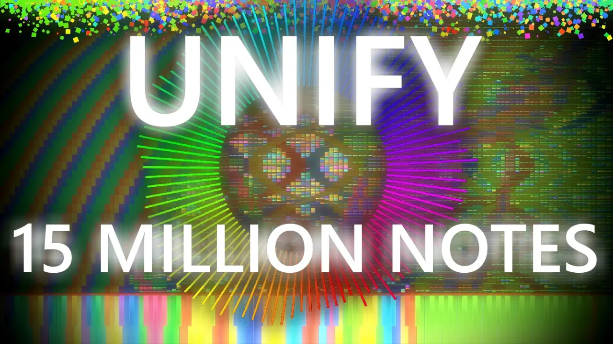

# 

Unify is a [black MIDI](https://en.wikipedia.org/wiki/Black_MIDI) medley which
was created as a 3-year-long collaboration between 15 talented composers,
musicians and artists, as well as (at the time) over 400 supporters in the
community Discord server.

The final update, released on February 19th 2021, has the following statistics:

| Statistic             | Value                   |
|-----------------------|------------------------:|
| Note count            | 15 560 914 notes        |
| Track count           | 138 MIDI tracks         |
| Duration              | 17 minutes, 51 seconds  |
| File size             | 119.2 MB                |
| Peak notes per second | 1.4 million notes       |
| Working time          | Many thousands of hours |

## Sections

Where applicable, a link to a video of the black MIDI from which inspiration
was drawn is included.

| Section                        | Contributors | Timestamp  |
|--------------------------------|---------|------:|
| Intro                          | HDSQ    | 0:00  |
| [Bad Apple](https://youtu.be/NQPfYx0utvM) | HDSQ | 0:45  |
| [Kobito and the Shining Needle](https://youtu.be/mXDvEH72nAE) | Kooijermax | 2:08  |
| [Night of Nights](https://youtu.be/REV6N77XvlY) | MBMS | 2:57  |
| [UN Owen Was Her](https://youtu.be/GCIPZrwOBSU) | Rappe | 4:08  |
| [Septette for the Dead Princess](https://youtu.be/suUTVNrGGpM) | Lucas Seth | 4:39  |
| Transition                     | HDSQ, Aiyui | 5:43  |
| [9KX2](https://youtu.be/E7e36Yc3e3w) | Aiyui, Eddywaltz, Archaeo PX | 6:06  |
| [The Destroyer](https://youtu.be/Y778aWYmWNw) | HDSQ | 7:19  |
| [Fractal Images](https://youtu.be/1ckTRZyJdWQ) | HDSQ | 8:20  |
| [Edge of the Seas](https://youtu.be/2nVIzvVl2aQ) | Archaeo PX | 8:31  |
| Transition                     | HDSQ | 8:58  |
| [Voyage 1969](https://youtu.be/FDcTAu9bx7c) | Everither | 9:18  |
| Insane                         | Hatter, Rjyren, The Convergence | 10:18 |
| [Last Summer](https://youtu.be/ubm0wm-S7ys) | 29FroilanJR | 11:32 |
| [Blue Sky](https://youtu.be/r69AsoBI-YU) | HDSQ | 12:27 |
| Finale                         | Eddywaltz, Hatter, Archaeo PX, Rappe, Knock, HDSQ | 13:42 |

## Contributors

Contributors marked with a ✨ deserve additional recognition for their
dedication and attention-to-detail.

* [29FroilanJR](https://www.youtube.com/@29FroilanJR)
* [Aiyui](https://www.youtube.com/@aiyuui)
* ✨ Archaeo PX
* ✨ [Eddywaltz](https://www.youtube.com/@eddywaltz4848)
* [Everither](https://www.youtube.com/@Everither)
* ✨ Hatter
* ✨ [HDSQ](https://www.youtube.com/@HDSQ) (project lead)
* ✨ Knock
* Kooijermax
* [Little Creeper](https://www.youtube.com/@LC-02)
* ✨ [Lucas9810](https://www.youtube.com/@LucasMIDI)
* ✨ [Lucas Seth](https://www.youtube.com/@LucassSeth)
* ✨ [MBMS](https://www.youtube.com/@MBMS)
* ✨ Rappe
* Rjyren

I couldn't find links for all creators. Please create a pull request if you
know of any links that I've missed.

## Downloads

You can download all of the releases of this project from the
[releases page](https://github.com/TheConvergenceProject/Unify/releases).
